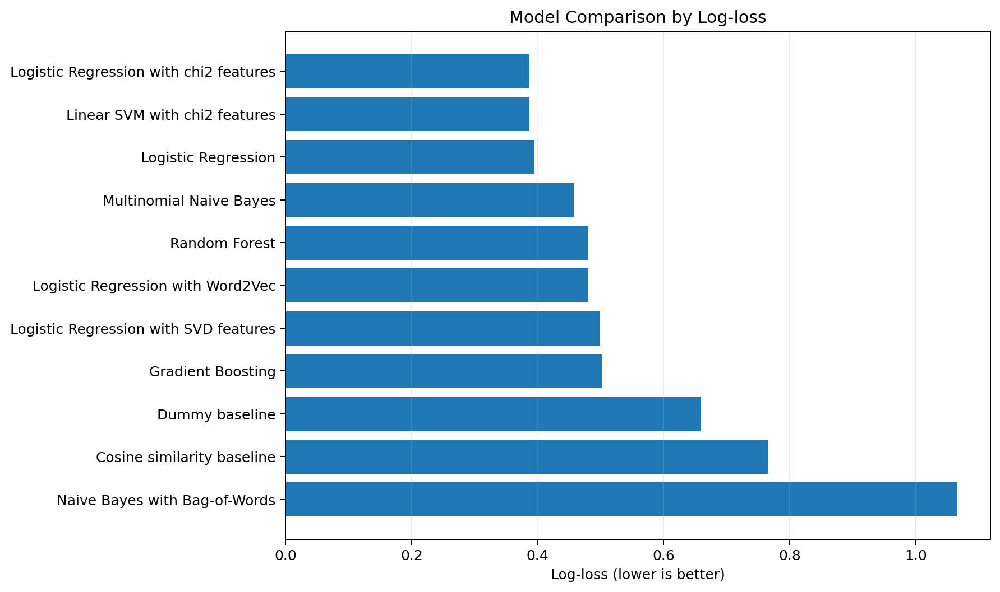
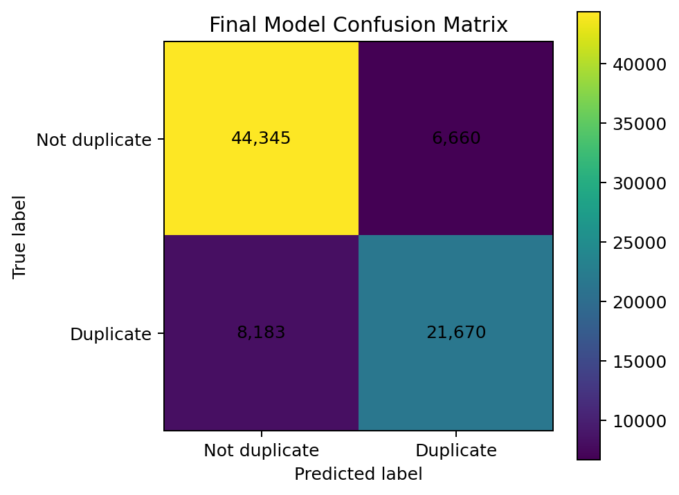

# Quora Duplicate Question Detection

A classical NLP and machine-learning project for predicting whether two questions express the same intent.

**Author:** L & F 
**Task:** Binary text-pair classification  
**Target:** `1 = duplicate`, `0 = not duplicate`

## Project summary

Duplicate-question detection is more difficult than simple word matching. Two questions can express the same meaning with different wording, while two questions can share many words but still ask different things.

This project treats the task as supervised binary classification and focuses strongly on **pairwise feature engineering**. It combines lexical similarity signals with high-dimensional TF-IDF pair features, compares several classical machine-learning approaches, and selects the final model using **log-loss as the primary metric**.

The final selected model is:

> **Logistic Regression with chi-square-selected TF-IDF pair features**

### Final test performance

| Metric | Result |
|---|---:|
| Log-loss | **0.386257** |
| Accuracy | **81.64%** |
| F1 score | **0.744891** |
| ROC-AUC | **0.897012** |

The held-out test set contains **80,858 question pairs**.



## Problem definition

Each observation contains two questions. The goal is to predict whether both questions have the same intent.

Examples:

**Duplicate**

```text
How do you start a bakery?
How can one start a bakery business?
```

Final model output:

```text
Probability duplicate: 0.5369
Prediction: 1
```

**Not duplicate**

```text
What is the step by step guide to invest in share market in India?
What is the step by step guide to invest in share market?
```

Final model output:

```text
Probability duplicate: 0.4355
Prediction: 0
```

The second example demonstrates why lexical overlap alone is insufficient: a small location term can change the intent.

## Dataset

The project uses the provided Quora question-pair CSV dataset.

| Item | Value |
|---|---:|
| Rows before cleaning | 404,290 |
| Rows after cleaning | 404,287 |
| Not duplicate (`0`) | 255,024 (63.08%) |
| Duplicate (`1`) | 149,263 (36.92%) |
| Training rows | 323,429 |
| Test rows | 80,858 |
| Train/test split | 80/20 stratified |

The original columns are:

```text
id, qid1, qid2, question1, question2, is_duplicate
```

For modelling, the notebook keeps the two question columns and the target label.

The dataset file is intentionally not bundled in this repository package. Place it at:

```text
data/quora.csv
```

## NLP preprocessing

The notebook creates two versions of the text because different features benefit from different levels of cleaning.

### Basic cleaned text

Used mainly for TF-IDF and Bag-of-Words:

- lowercase conversion
- selected contraction expansion, such as `can't -> can not`
- removal of non-alphanumeric characters
- whitespace normalization
- preservation of most words to avoid removing terms that can change intent

### Reduced cleaned text

Used mainly for overlap features:

- starts from the basic cleaned text
- removes English stopwords
- applies Porter stemming when NLTK is available

This design avoids relying on one aggressive preprocessing strategy for every feature type.

## Feature engineering

Feature engineering is the core of the project because the model must compare two texts rather than classify one isolated text.

### Manual similarity features

The notebook creates 16 initial similarity features, including:

- character lengths
- word lengths
- absolute length differences
- length ratios
- number of common reduced words
- Jaccard similarity
- common-word ratios
- bigram Jaccard similarity
- exact-match flag
- containment flags

After TF-IDF cosine similarity is added, the manual feature set contains **17 features**.

### TF-IDF pair representation

The vectorizer is fitted only on the training questions to avoid data leakage.

Key configuration:

```python
min_df=2
max_df=0.95
max_features=70000
sublinear_tf=True
ngram_range=(1, 2)
```

Question 1 and question 2 are transformed using the same vectorizer.

The pair representation then uses:

1. **Absolute TF-IDF difference** — captures what changes between the two questions.
2. **Element-wise TF-IDF product** — captures important terms shared by both questions.
3. **TF-IDF cosine-like similarity** — derived from the shared product of normalized vectors.

The resulting TF-IDF pair matrix contains **140,000 columns**. Combined with the 17 manual features, the full representation contains **140,017 features per question pair**.

## Models evaluated

The notebook compares a broad set of baselines, classifiers, and representations:

- Dummy baseline
- Cosine-similarity baseline
- Logistic Regression
- Logistic Regression + chi-square feature selection
- Multinomial Naive Bayes
- Naive Bayes + Bag-of-Words
- Random Forest
- Gradient Boosting
- Linear SVM with calibrated probabilities
- Logistic Regression + Truncated SVD
- Logistic Regression + Word2Vec

Chi-square feature selection reduces the non-negative TF-IDF pair representation from **140,000 to 40,000 selected features** before the strongest Logistic Regression model is trained.

## Model comparison

| Model | Log-loss | Accuracy | F1 | AUC |
|---|---:|---:|---:|---:|
| **Logistic Regression with chi2 features** | **0.386257** | **0.816431** | **0.744891** | **0.897012** |
| Linear SVM with chi2 features | 0.387112 | 0.816407 | 0.744188 | 0.896412 |
| Logistic Regression | 0.395057 | 0.814972 | 0.743595 | 0.895089 |
| Multinomial Naive Bayes | 0.458474 | 0.786478 | 0.678138 | 0.866647 |
| Random Forest | 0.480178 | 0.736946 | 0.643957 | 0.821590 |
| Logistic Regression with Word2Vec | 0.480820 | 0.748943 | 0.641874 | 0.830152 |
| Logistic Regression with SVD features | 0.499240 | 0.730528 | 0.620209 | 0.810607 |
| Gradient Boosting | 0.502212 | 0.720065 | 0.612925 | 0.801134 |
| Dummy baseline | 0.658530 | 0.630797 | 0.000000 | 0.500000 |
| Cosine similarity baseline | 0.766426 | 0.627903 | 0.463336 | 0.676218 |
| Naive Bayes with Bag-of-Words | 1.064931 | 0.792154 | 0.726072 | 0.872661 |

The final Logistic Regression + chi-square model is selected because it gives the **lowest log-loss** and also the strongest overall accuracy, F1, and AUC among the tested approaches.

## Final model evaluation

Classification results for the selected model:

| Class | Precision | Recall | F1 | Support |
|---|---:|---:|---:|---:|
| Not duplicate | 0.84 | 0.87 | 0.86 | 51,005 |
| Duplicate | 0.76 | 0.73 | 0.74 | 29,853 |
| **Overall accuracy** |  |  | **0.82** | **80,858** |

Confusion matrix:

```text
[[44345  6660]
 [ 8183 21670]]
```

- True negatives: **44,345**
- False positives: **6,660**
- False negatives: **8,183**
- True positives: **21,670**



## Prediction-pipeline debugging

One important development issue occurred in the final prediction function.

Different trained models require different feature representations. For example:

- chi-square Logistic Regression and Linear SVM require chi-square-selected TF-IDF pair features
- Multinomial Naive Bayes requires the TF-IDF pair matrix
- Bag-of-Words Naive Bayes requires CountVectorizer pair features
- Random Forest and Gradient Boosting use manual features
- SVD and Word2Vec models use their own dense representations

The prediction pipeline was reorganized so that each model receives the same feature structure used during training. This removed feature-shape and missing-variable problems and made the workflow consistent from model training through inference.

## Main findings

The experiments show that **text representation matters as much as classifier choice**.

- Manual overlap features are interpretable but do not preserve enough detailed lexical evidence on their own.
- TF-IDF pair features effectively preserve both shared words/phrases and differences between the two questions.
- Chi-square selection removes noisy dimensions while keeping the most informative non-negative TF-IDF pair features.
- SVD and Word2Vec produce compact dense representations, but in this experiment they lose useful lexical detail.
- Naive Bayes can achieve reasonable classification accuracy, but the Bag-of-Words experiment has poor probability quality according to log-loss.
- The simple dummy baseline demonstrates why accuracy alone is misleading on the moderately imbalanced dataset.

## Limitations

The current system is based mainly on lexical and short-phrase information.

Important limitations include:

- TF-IDF does not fully capture deep semantic meaning.
- Semantically equivalent questions with very different wording can still be missed.
- Small words, named entities, and location terms can significantly change intent.
- Performance depends on having enough representative examples for subtle distinctions.

## Future improvements

Potential extensions discussed in the project include:

- decision-threshold tuning
- probability calibration
- cross-validation of the complete pipeline
- modern sentence embeddings
- transformer-based semantic models

The notebook includes an optional stratified cross-validation block, disabled by default.

## Repository structure

```text
quora-duplicate-question-detection/
├── README.md
├── quora_duplicate_question_detection.ipynb
├── requirements.txt
├── .gitignore
├── assets/
│   ├── confusion_matrix.png
│   └── model_log_loss.png
├── data/
│   └── README.md
├── docs/
│   └── NLP_TM_Assignment_Report.docx
└── results/
    ├── final_metrics.json
    └── model_comparison.csv
```

## Installation

Create a virtual environment and install the dependencies:

```bash
python -m venv .venv
```

Windows:

```bash
.venv\Scripts\activate
```

macOS/Linux:

```bash
source .venv/bin/activate
```

Install packages:

```bash
pip install -r requirements.txt
```

## Running the project

1. Place the Quora CSV file at `data/quora.csv`.
2. Open `quora_duplicate_question_detection.ipynb`.
3. Run the notebook from top to bottom.
4. Review the model-comparison table and final evaluation.
5. Use the final prediction function to test new question pairs.

The notebook metadata records Python **3.12.7** for the completed run.

## Saved model bundle

The final notebook saves:

```text
quora_duplicate_final_model_bundle.joblib
```

The bundle contains the final model, TF-IDF vectorizer, numeric scaler, chi-square selector, feature-column metadata, selected model name, and results table.

Generated model binaries are excluded through `.gitignore` and are not included in this project package.

## Conclusion

The best-performing solution is **Logistic Regression with chi-square-selected TF-IDF pair features**, achieving **0.386257 log-loss, 81.64% accuracy, 0.744891 F1, and 0.897012 AUC** on the held-out test set.

The project demonstrates that duplicate-question detection is primarily a **text-pair representation problem**. Combining detailed TF-IDF difference/shared features with interpretable similarity signals and targeted feature selection produced the strongest and most reliable result among the tested classical NLP approaches.
